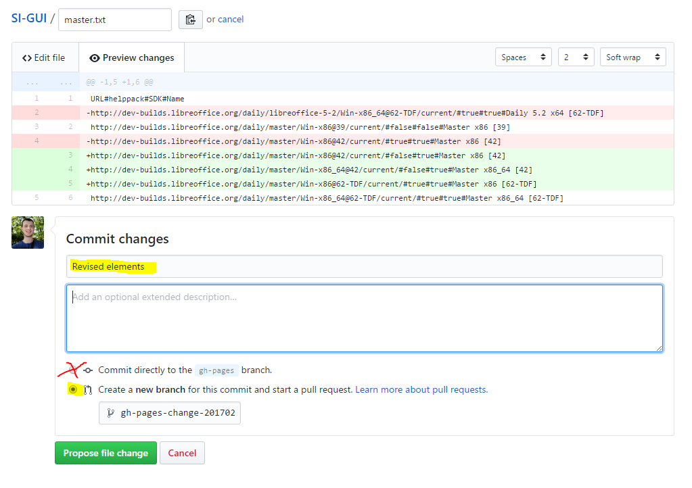
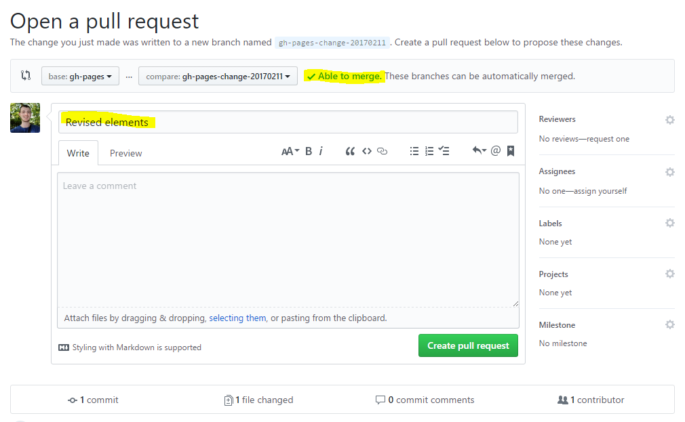
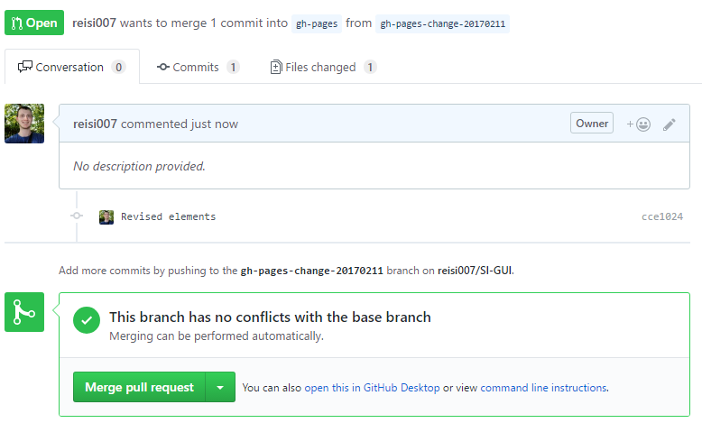

# How to change builds in SI-GUI

1) Go to [Github](https://github.com/reisi007/SI-GUI/blob/gh-pages/master.txt "Master.txt at Github")

    - If you are not logged in please login
    - Note: I have access rights to the repo, so please tell me if it works like that!

2) Click the "Edit button" 

3) After editing switch to the "Preview changes tab" to check if you only changed intended things.

    - Note: It is not recommended to change the order of the elements to often
   
    - Please be aware of the structure. The following elements must be in one line, seperated by `#`characters and without additional `#` characters:
      
        - Url (the actual URL to the folder where the files are.)
         For the Url `http://dev-builds.libreoffice.org/daily/master/Win-x86@42/current/?C=M;O=A` please make sure to remove everything after `?' after `current`.
         **This will break SI-GUI otherwise!**
         - helppack: Either `true` or `false` indicating if helppacks are built
         - sdk: Either `true` or `false` indicating if sdk is built
         - Name: The name, which should be visible in SI GUI
    - The preview can look like this: 
        - Please give a short description of the change (`Removed @62` or `Updated @62` or `Added @63` is totally fine. Ideally this is a summery of your changes)
        - You should only be able to do the second option from the picture
            - If you correctly do this step you will get permission to do stiff within this so-called repository. If you have rights, you can use the first options to make the changes go live immediately!
        - If you are done, click `Propose file change`
            - When not having special permission, this will result in a so-called `pull request`. This means I (and other with special permissions) can see you proposed a change and add it with one click.
    - You get redirected to the "Open pull request" - page 
        - In the top section there should be a ` Able to merge`. If not - do not worry I will deal with it ;)
        - Click `Create pull request`
        
    - Done :D 
        - With this I can merge (publish the changes) with one click
        - You will get notified when I merged your changes
        - Update the list of versions within SI-GUI